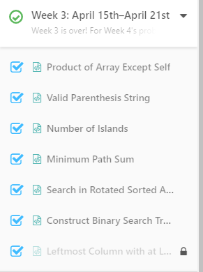
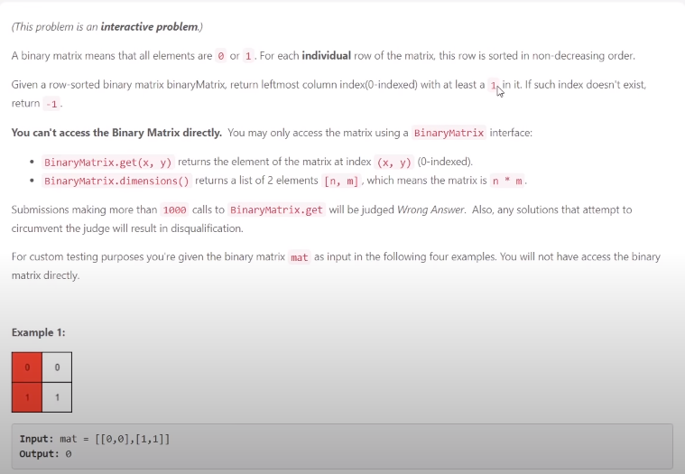

# Day 21

## Leftmost Column with at least a One

Big note, leetcode went ahead and made the last challenge on ever week premium so I did solve this, but now I can't even see my own solution.  
What a bummer :C



Question:  
This will just be a screenshot.  


Solution: 

Note since I cannot check and run this solution I got no idea if this will still pass.

```python3
:C my solution

```

Explaination:  
For this I remember the algo being, starting from the top right,  
check if the left number is a 1.  
- If it is shift the index, set the index and continue checking left
- If it is a 0, go down and check

Continue until reach the bottom or the right most index(0), return the index.  

Time Complexity:  
< O((N+1) * (N) / 2) cause we dont check all in the worst case
I think the worst case is the pyramid case?

Space Complexity:  
O(1) constant space

